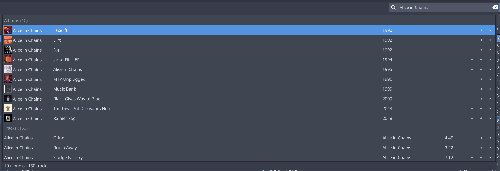

# Trackknife

Trackknife is a Linux music player, MPD client, and tag editor built with Qt 6.
It's inspired by foobar2000 and Cantata. The name is a nod to foobar2000's
reputation as a Swiss Army knife for audio files.


## What it does

- MPD and Melody: library browsing, album and track search, queue editing,
  playlists, cover art, and output controls.
- Local playback: gapless audio through PipeWire, cue sheets and subsongs,
  folder browsing, and tabs saved between sessions.
- Optional local library: browse artists and albums, search albums and tracks,
  and keep browsing cached tags when a drive is disconnected.
- Bulk tagging, MusicBrainz lookup, AcoustID fingerprinting, and cover downloads.
- Track and album ReplayGain scanning with true peak measurement.
- Parallel conversion to FLAC, Opus, MP3, and Vorbis, with resampling and dither.
- Rename and move files using naming patterns, with a preview before applying.

Tag writing supports FLAC, WavPack, MP3 (ID3v2), Ogg Vorbis, and Opus.
Writes are checked for unchanged audio and correct tags; other formats are
read-only.

## Getting started

Open files or folders to play locally. For an indexed collection, select
**Local Queue**, switch the sidebar from **Folders** to **Library**, then use
**Folders…** to add your music. Scanning runs in the background.
See [local library](docs/local-library.md) for details.

For MPD or Melody, use **File → Connect to MPD…** and enter the server's host
and port (usually `6600`). MPD and local files have separate queues and playback.
See [Melody setup](docs/melody.md) for server configuration, remote speakers,
and access to server files for tagging.

## Screenshots

Album and track search:



Bulk tagging:


MusicBrainz lookup:


Conversion:


Renaming:


## Scripting

Naming patterns and tag transformations use Trackknife's own language,
`tkfmt-1`. For example, to organize files by artist and album:

```text
%albumartist%/%album%/$num(%tracknumber%,2) - %title%
```

See the [language guide](docs/tkfmt.md) for examples. Foobar2000 and Picard
scripts aren't directly compatible.

## Status

Still in development; no versioned releases yet. Expect rough edges.
See [MILESTONES.md](MILESTONES.md) for progress.

## Building

Dependencies: Qt 6 (base), FFmpeg, TagLib ≥ 2.0, libmpdclient, libopenmpt,
libutf8proc, PipeWire, libebur128, SQLite. Build tools: CMake ≥ 3.28 and
Ninja. Optional at runtime: chromaprint (`fpcalc`) for AcoustID
fingerprinting.

```sh
cmake --preset release
cmake --build build/release
./build/release/src/bench/trackknife
```

On Arch Linux, you can build and install the latest repository version with
the included PKGBUILD:

```sh
cd packaging/arch && makepkg -si
```

To run tests during the package build, use `TRACKKNIFE_CHECK=1 makepkg`.
Development builds and tests:

```sh
cmake --preset dev && cmake --build build/dev
cd build/dev && ctest
```

## License

GPL-3.0-only. See [LICENSE](LICENSE).
