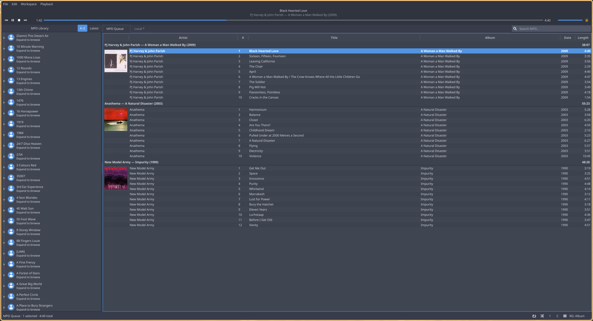
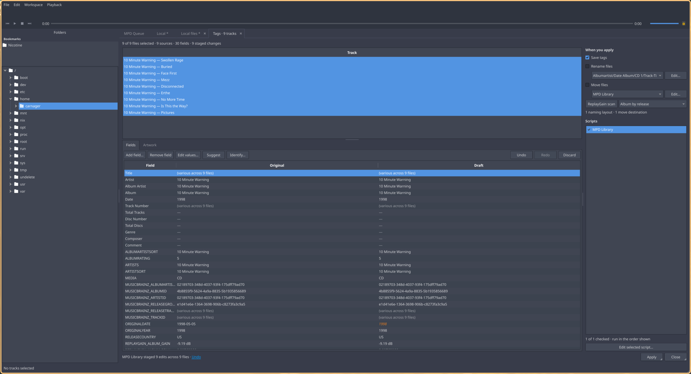
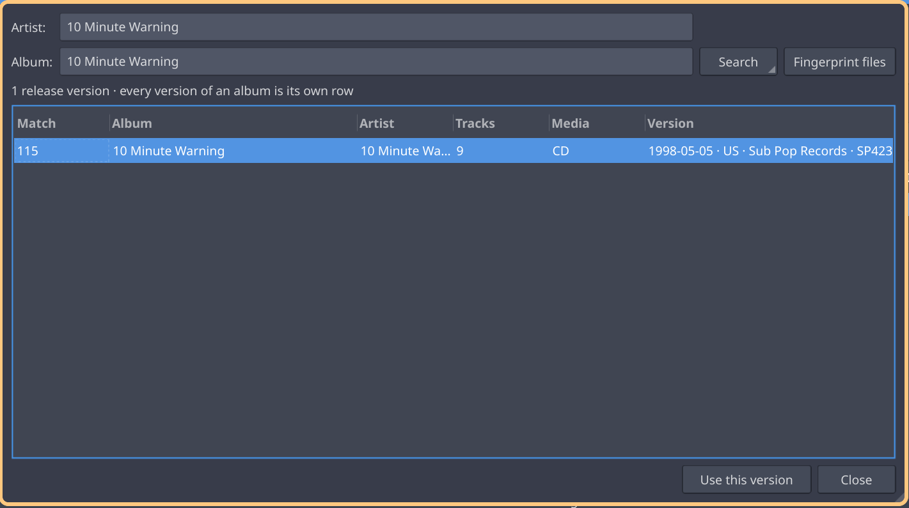
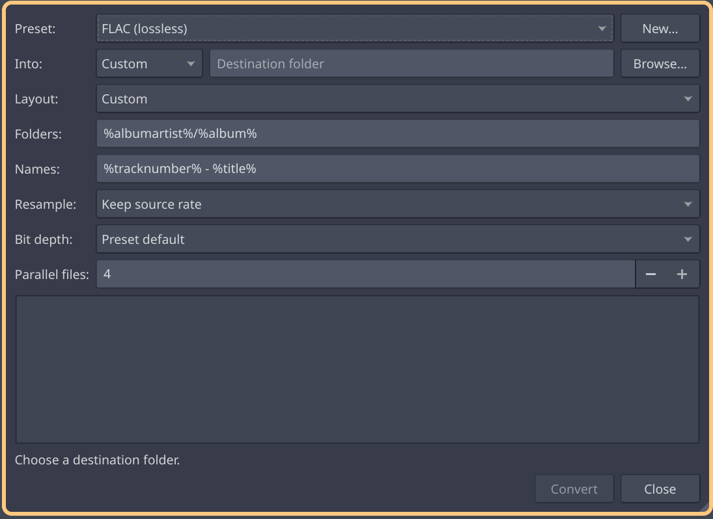
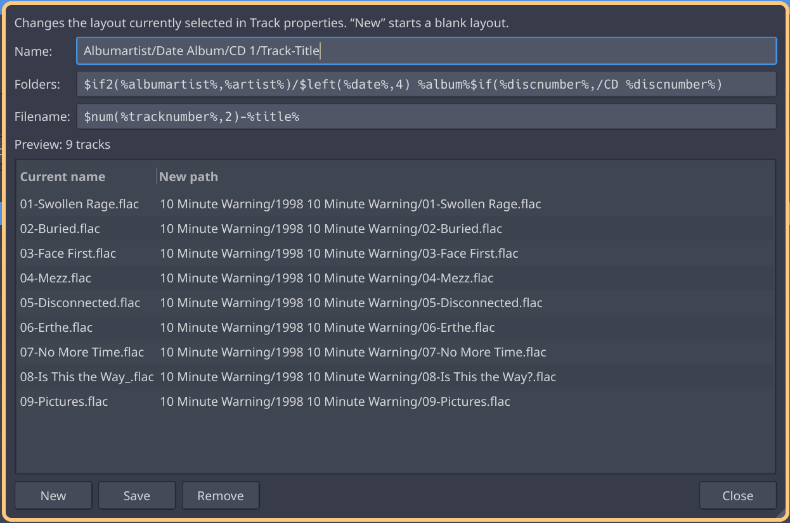

# Trackknife

Trackknife is a music player and collection editor for Linux, built with Qt 6.
You can use it to listen through MPD or play local files, edit tags, look up
releases on MusicBrainz, scan ReplayGain, convert formats, and organize folders.
MPD and local files have separate tabs, each with its own playback controls
and tools.

The inspiration comes from foobar2000's audio tools and Cantata's MPD client.
The aim is to bring the things that made both useful into one native Linux
application. The name is a nod to foobar2000, often called a Swiss Army knife
for audio files.



## What it does

With MPD, you can:

- Browse and search your server's library, alphabetically or with the newest
  additions first (requires MPD 0.24's `Added` field).
- Edit the queue, set track priorities, change playback and ReplayGain modes,
  toggle individual outputs, and view cover art.
- Jump from a queued track to its artist or album in the library tree.
- Open tracks or albums in a local tab for tagging or conversion, then ask
  MPD to rescan the affected folder. This requires access to the files and a
  music-root mapping in settings.

For local files, there's:

- Gapless playback through PipeWire, tabs that survive restarts, and a folder
  browser with bookmarks. Cue sheet tracks and subsongs appear as individual
  tracks.
- A tag editor for working on many files at once. Changes are highlighted and
  can be undone before saving, including edits made by automatic scripts.
- MusicBrainz lookups, AcoustID fingerprinting, and artwork downloads from the
  Cover Art Archive.
- Track and album ReplayGain scanning using EBU R128, with true peak
  measurement and album grouping by release, tag, or expression.
- Parallel conversion with FLAC, Opus, MP3, and Vorbis presets, plus presets
  you can save yourself. Options include resampling and 16/24-bit output with
  dither. Tags are copied to the output and checked after conversion.
- Renaming and moving based on naming expressions, with a path preview and
  a journal for recovery if the operation is interrupted.

Tag editing currently supports FLAC, WavPack, MP3 (ID3v2), Ogg Vorbis, and Opus.
After writing, Trackknife checks that the audio bytes are unchanged and rereads
the tags to check them against your edits. Other formats are read-only until
their tag writers pass the same checks.

File operations and conversion also work on NFS, sshfs, and FAT. When a
filesystem cannot preserve attributes such as ownership or extended
attributes, Trackknife reports what was left out.

## Screenshots

Editing tags across several files, with pending changes highlighted:



Choosing a release on MusicBrainz:



Previewing output paths before conversion:



Setting up a naming pattern and checking the resulting paths:



## Scripting

You can customize filenames, conversion paths, library trees, ReplayGain
grouping, and tag transformations with `tkfmt-1`. It's Trackknife's own
formatting language, inspired by foobar2000's title formatting. For example,
this pattern sorts files into artist and album folders:

```text
%albumartist%/%album%/$num(%tracknumber%,2) - %title%
```

See the [language guide](docs/tkfmt.md) for syntax and examples, or the
[specification](docs/title-formatting.md) for the full language rules.

## Status

Trackknife is still in development, with no versioned releases yet. Expect
rough edges and changes between builds. The local database is upgraded
automatically when its format changes.

See [MILESTONES.md](MILESTONES.md) for development progress and
[docs/adr/](docs/adr/) for the reasoning behind design decisions.

## Building

Dependencies: Qt 6 (base), FFmpeg, TagLib ≥ 2.0, libmpdclient, libopenmpt,
libutf8proc, PipeWire, libebur128, SQLite. Build tools: CMake ≥ 3.28 and
Ninja. Optional at runtime: chromaprint (`fpcalc`) for AcoustID
fingerprinting.

```sh
cmake --preset release
cmake --build build/release
./build/release/src/bench/trackknife
```

On Arch Linux, you can build and install the latest repository version with
the included PKGBUILD:

```sh
cd packaging/arch && makepkg -si
```

To run tests during the package build, use `TRACKKNIFE_CHECK=1 makepkg`.
For development, the `dev`, `asan`, `tsan`, and `tidy` presets all support the
full test suite. To build and test with `dev`:

```sh
cmake --preset dev && cmake --build build/dev
cd build/dev && ctest
```

## License

GPL-3.0-only. See [LICENSE](LICENSE).
